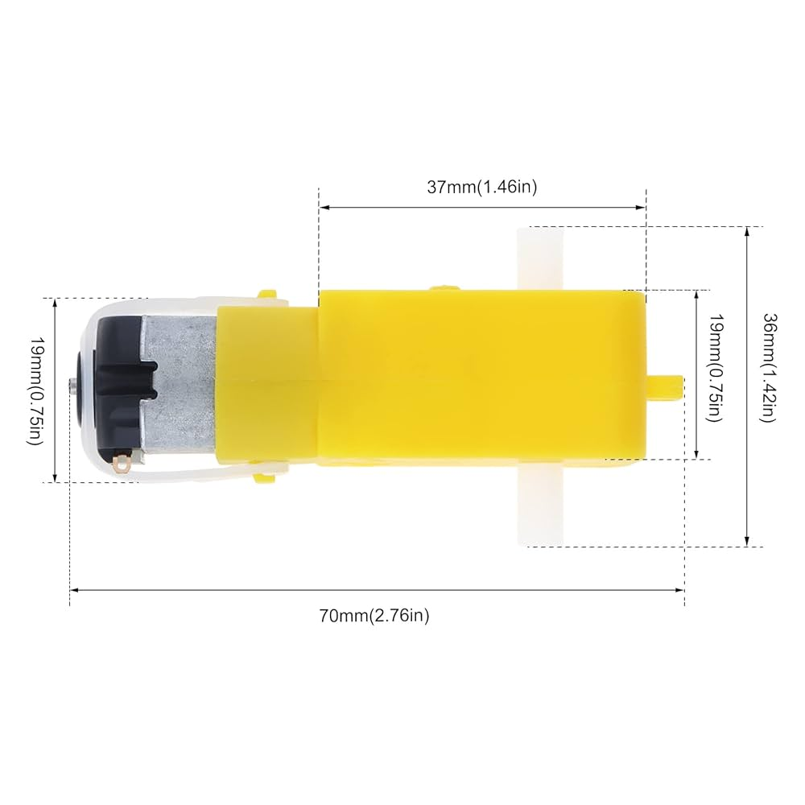

# R2-D2 Version 1

**DISCLAIMER!!! This project is not currently in a working state**

This is a project I hope to work on long term. For now I am starting off with a very simple differential drive robot controlled by an ESP32 and PS4 controller. I am using an L298N dual h-bridge for control of 2 DC motors. I will also be using a few sg90 servos for control of its legs and head. 

I will do my best to put any and all information on how I completed this project in this repository incase someone else would like make this. 

## Connecting the ESP and PS4 controller

To connect my PS4 controller to the ESP I am using the Bluepad32. I used the following tutorial to set it up and run an example.

https://racheldebarros.com/connect-your-game-controller-to-an-esp32/

The tutorial walked me through every step but left out a few small details that I will include here. 
1. To get a PS4 controller into pairing mode you start with the controller off, then hold the share button, and start holding the PS button a second later.
2. After pairing once you will not need to pair again however, the ps4 contoller will turn off when the ESP is reprogrammed (there were a few times i forgot to turn the controller back on but that may ust be me being stupid lol)
3. The processGamepad() function in the example does work but it has a few issues that I fixed in mine
   - you cannot press multiple buttons at the same time
   - when pressing one button on the Dpad it would get immediatly overwritten by the other Dpad buttons not being pressed
     
## Motor control 

I am using an L298N dual H-bridge motor controller to control the speed and direction of 2 12V DC motors with 90 degree gear boxes. 

**L928N H-bridge:**  

**12V DC Motor:**  

The L298N has 2 types of intputs, power and data. The power inputs control the voltage the motors will be driven at, in my case I am using the 12V input and ground from a 12V Li-ion battery. However, there is a 5V input if you are using smaller motors. Additionally, don't forget to common the grounds between your motor voltage source (battery) and your control circuit. The data inputs are what control the speed and direction, 4 pins labeled IN1-IN4 control the direction. IN1 and IN2 controlling the direction of motor A, and IN3 and IN4 controlling the direction of motor B, the table below has more detail. Speed control is done through the ENA and ENB pins, which stand for enable A and enable B. By default these pins have a jumper on them tying them to a logical high which means the motor will always be driven at full speed. I removed this jumper so I can implement speed control by utilizing a PWM signal, by varying the duty cycle I can change the speed of the motor. With a high duty cycle the average voltage is higher making the motor go faster and vise versa for a low duty cycle.

Here is a good tutorial for how to use the L298N: https://lastminuteengineers.com/l298n-dc-stepper-driver-arduino-tutorial/ 

**L298N Truth Table:**
| IN1/IN3 | IN2/IN4 | Output |
| ------- | ------- | ------ |
| Low (0) | Low (0) | Motor off |
| High (1) | Low (0) | Forward |
| Low (0) | High (1) | Backward |
| High (1) | High (1) | Motor off |
